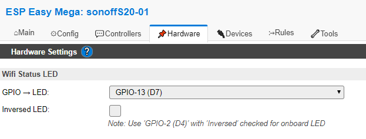
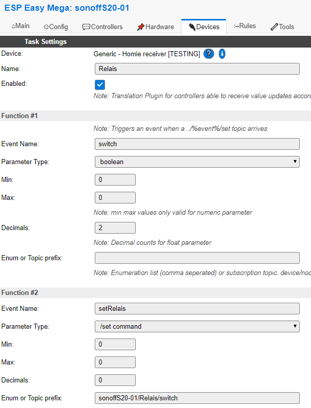
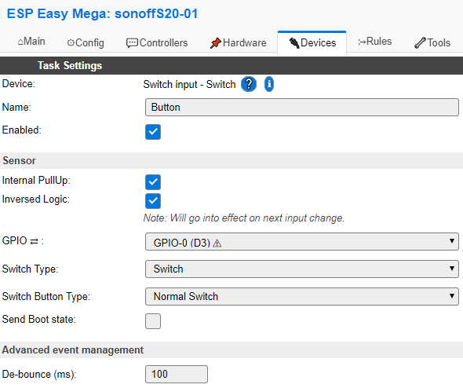
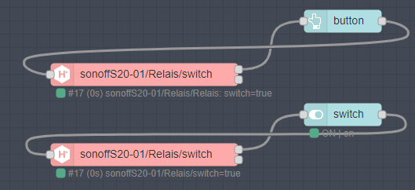

# Using the sonoff S20 (and others) with ESPEasy & homie

version 0.0.2

The sonoff S20 is a nice cheap wall plug including an ESP8266. It comes (currently) with only 1MB of flash memory which makes OTA updates difficult. For OTA you need minimum of twice the size of your firmware to do OTA updates. But as some of the flash is needed for other things even 512kb will be too big (604Kb is the absolute maximum for the two step method)

The current firmware if 607kb - So I have to strip down it a little bit more.... sorry

# configure ESPeasy
## main
parameter        |description
-----------------|--------------------------
Unit Name:|give your device a nice **UNIQUE** name (will appear as $device inside the homie tree) so no spaces and only - or _ is suggested here (even when MQTT is not so restrictive)
Unit Number:| optional
Append Unit Number to hostname:| unchecked because the paramter is optional
WIFI Settings| self explanatory
IP Settings| if you don`t use DHCP make sure the IP Address is not in use otherwise you have to use the serial console to fix that

Don`t forget to hit the **submit** button!

## Controllers
Add the homie controller

parameter        |description
-----------------|--------------------------
Controller IP:| the IP Address of your MQTT broker (or URL)
Controller Port:| usual 1884
Controller User / Password: | if necessary
Controller Subscribe: | homie/%sysname%/+/+/set
Controller Publish: | homie/%sysname%/%tskname%/%valname%
Controller lwl topic: | homie/%sysname%/$state
LWT Connect Message: | ready
LWT Disconnect Message: | lost 

The subscribe pattern makes sure that ESP Easy only receives commands this keeps the load on the ESP low. Alternatively `homie/%sysname%/#` can be used but not recommended!

## Hardware


use inverse LED if you like the LED flashes to be visible
## Devices

For the relay you need the homie receiver plugin

*Sorry for the typo of "Relais" this is the German spelling of "Relay" find/replace if you wish ;)*



For the hardware button you need a switch input

set the debounce value what fits best for you (10-100ms)

## Rules
You need two rules:
1. will set the GPIO according to the boolean value received and acknowledge the new value with HomieValueSet
2. Rule triggers when the hardware button is pressed. Depending on the current state of the relay it will send a /set command to the mqtt broker. This will then trigger rule #1. If you prefer immediate response of the relay you can set the GPO here too but you may loose consistency of the state on the mqtt broker with the state of the gpio but you win the ability to operate the relay even without wifi connection or working broker.

```
on Relais#switch do
 gpio,12,[Relais#switch]
 HomieValueSet,1,1,%eventvalue1%
endon

on Button#State=1 do
 if [Relais#switch]=0
  gpio,12,1
  HomieValueSet,1,2,true
 else
  gpio,12,0
  HomieValueSet,1,2,false
 endif
endon
```

To build a remote switch you will need the same configuration but without setting the GPIO (as it will be on a remote ESP). Will publish a remote wall controller as soon it is finished.

# check the log

if you send **true** to `/homie/yourDevice/Relais/switch/set`:
```
593092 : EVENT: Relais#switch=true
593107 : ACT  : gpio,12,1.00
593115 : SW   : GPIO 12 Set to 1
593134 : ACT  : HomieValueSet,1,1,true
```
`/homie/yourDevice/Relais/switch` should show **true** now.

now send **false**:
```
204947: EVENT: Relais#switch=false
204977: ACT  : gpio,12,0.00
204983: SW   : GPIO 12 Set to 0
205000: ACT  : HomieValueSet,1,1,false
```
`/homie/yourDevice/Relais/switch` should show **false** now.


now press the hardware button:
```
754576 : SW  : GPIO=0 State=0 Output value=1
754581 : EVENT: Button#State=1.00
754622 : ACT  : HomieValueSet,1,2,true
754691 : EVENT: Relais#switch=true
754711 : ACT  : gpio,12,1.00
754719 : SW   : GPIO 12 Set to 1
754737 : ACT  : HomieValueSet,1,1,true
754776 : SW  : GPIO=0 State=1 Output value=0
754786 : EVENT: Button#State=0.00
```
`/homie/yourDevice/Relais/switch` and `/homie/yourDevice/Relais/switch/set` should show **true** now.

now reboot (while state is still true)
```
6257 : MQTT : Connected to broker with client ID: ESPClient_18:FE:34:CC:D2:56
6262 : Subscribed to: homie/sonoffS20-01/+/+/set
6266 : EVENT: MQTT#Connected
6865 : EVENT: Relais#switch=true
6886 : ACT  : gpio,12,1.00
6892 : SW   : GPIO 12 Set to 1
6909 : ACT  : HomieValueSet,1,1,true
```
the last setting should be restored

So in the state off the relay should be always consistent with the state of the mqtt broker

# Node-RED

It is quite easy to use any homie switch in Node-RED. 

**Always check that you don't pass the input message to the output or you get an infinit loop!**



If you have more than one ui-node connected as in the example you see both are displaying the correct value without being connected. They even could sit on different instances or machines.  So it is not necessary and not recommended to store the state in Node-RED. Even if you press the hardware button during Node-RED is offline it will come up with the actual state as soon it gets online again. This is the nature of MQTT + retained messages to let all subscribers be always up to date.

It is possible to connect a button or a switch to the homie node. If you want to use the button you have to update to version 0.0.6 of the homie node to handle boolean values correctly.

you can find a demo flow here `demo-flow.json`

# changelog

- **0.0.2** some typos fixed