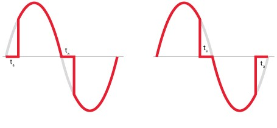
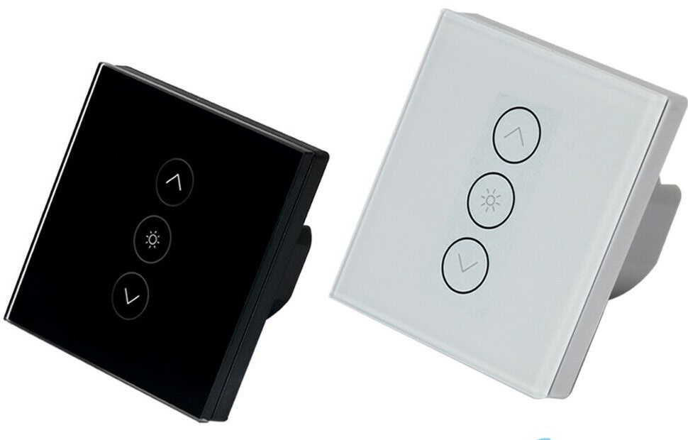
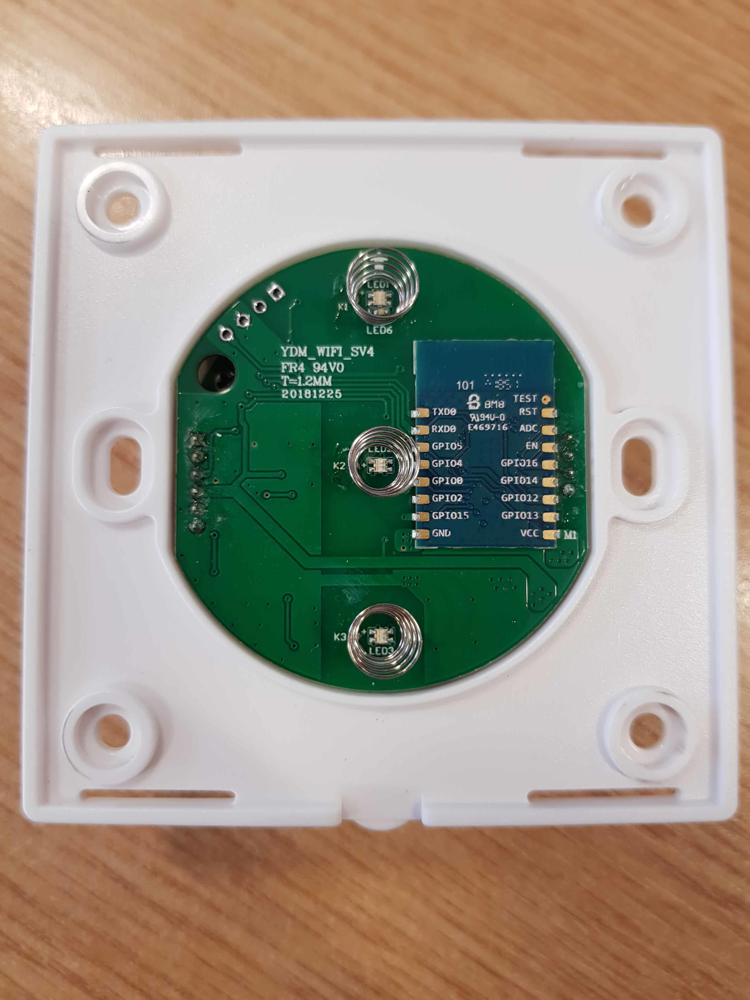
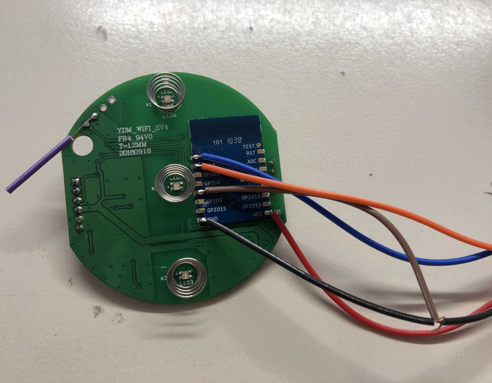
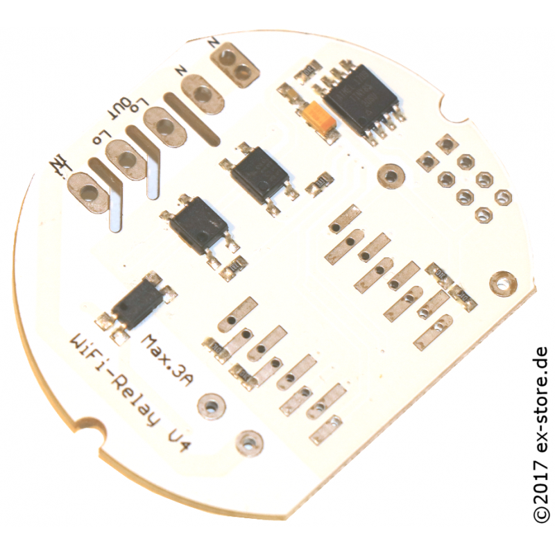
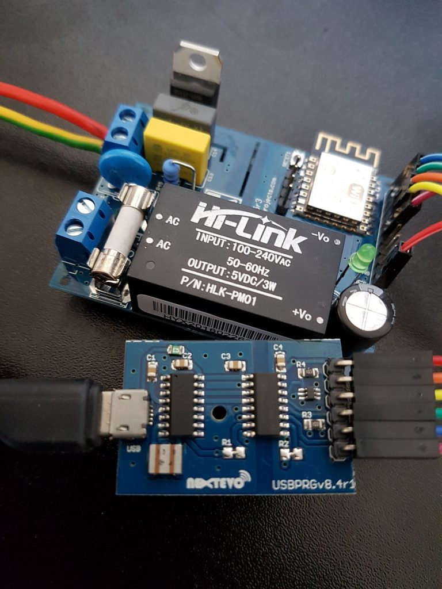

# dimming mains power
 
## introduction

Dimming mains power is not a trivial thing. Basically it has to be in sync with the mains frequency by detecting the zero line crossing trigger an interrupt and switches the power for a fraction of the full phase on or off.
 
If your mains frequency is 50hz then the sine curve is oscillating 50 times per second. You have a high peak every 1/100 a second and a low peak the other 1/100. If you want to dim it by 256 steps you have to time with an accuracy of 25.600hz. For example switch only 1/2 of the peak the power on and the other one off.

The esp is particularly not very good in precise timing because it has to do other things like wifi too. Either wifi crashes or your lamp could flicker. That’s why you don’t see an esp with these simple circuits very often. 

LED and especially their power supply are not very happy when they get very harsh power spikes used in [Phase-fired control (PFC) or leading-edge dimmer](https://en.wikipedia.org/wiki/Phase-fired_controller). That`s why dimmer which stops the current after a period so called [Burst-fired controllers or tailing edge dimmer](https://leapfroglighting.com/trailing-edge-or-leading-edge-led-dimming/) are better than dimmers which switches the power on. Unfortunately cheaper TRIAC dimmers are not able to switch of when current is running. Mosfet dimmer are a little bit more expensive but could run as both and are easier to be controlled by micro controllers)

## how to dim mains power with an mcu

As noted before it is good an common practice to control the dimming through an dedicated mcu. Another mcu like the ESP8266 can do the network things and send commands to the dimmer mcu. The systems differentiate by how they are communicating.

- serial interface (like tuya dimmers)
- i2c or spi bus (would be nice because i2c can be host several devices on one 2-wire bus)
- analog input (a little bit old school because you need a digital to analog converter connected to an analog to digital converter ???) known as 1-10V or 0-10V. 

## serial dimmer mcu aka tuya dimmer

The tuya device uses a second mcu to do the dimming (and touch sensors and LEDs) and connect them via serial to an esp. The advantage is that the dimming is done by the mcu where the wifi mqtt stuff is done by the esp. 

1. the serial port is blocked and flashing ESPEasy is a little bit difficult (you perhaps need to cut a trace on the pcb and repair it afterwards) and solder 5 wires on the esp8266 esp8285 or tuya module. The pins you have to find is RX/TX for serial, VCC/GND for power and GPIO0 to start flash mode connected to ground during boot/power up. Likely you have to cut the RX wire running from the esp to the mcu during flashing. Use a 3.3V usb to serial converter to connect the esp8266 to your computer.

**NEVER EVER connect your computer (or yourself) when the device is powered to mains. You not only risk your life you risk the innocent life of your computer too;)**

2. you can only control the dim level and on/off state but not the leds or sensor buttons. Because they are controlled by the mcu. This is understandable because the esp has no touch inputs, perhaps it will change soon wen the ESP32 is getting more common with mor i/o lines and touch input.

The advantage is you have a nice case, power supply and my version is dimming LEDs down to 30-40%. There is a [hack of the ota update function](https://everythingsmarthome.co.uk/howto/tuya-convert-guide-ota-flashing-of-smart-bulbs-and-plugs/) available but i haven’t tested it.

You find a firmware in the firmware folder with a homie/tuya version of ESPEasy.

Steps:

1. unplug the top board
2. solder the wires and give it a try. cut the RX race if necessary
3. flash the firmware
4. Test and setup ESP Easy. Make sure that serial debugging is disabled (advanced settings) other wise you end up in a boot loop
5. unsolder the wires and repair the pcb trace
6. reconnect the top board, make sure you don`t shift the pins.
7. close the cover and connect the dimmer to mains and an incandescent bulb.
8. do some tests. The manual dimming should work without ESPEasy configured and working

## ex-store serial dimmer

This pcb comes with no human interface. I hope I can upgrade two traditional dimmers with two rotary encounters (the esp8266 has only one adc so you can use a potentiometer only for one dimmer). It uses also a dedicated mcu two but the interface is well documented and from a [small developer in Berlin](https://blog.ex-store.de/content/aufbau-anleitung-wifidimmer-v4) ;) And it fits into a wall mount as our home is from 1890 with thick and heavy brick walls and a old electrical installation. Sometimes I’m get jealous when I see easy installation in dry walls.
I`m interested from where I get 2x6 free GPIO pins for 2 rotary encoders. only 4 are available on the pcb. as TX/RX is used by the MCU it could be a challenge. Perhaps I have to sacrifice two of my i2c rotary encoders ... why not?

## other interesting pcb

If you space mor space this board is interesting too. This guy is developing mains dimmers for quite a long time. This is the 7th incarnation

[It is available on tindy](https://www.tindie.com/stores/next_evo1/) form Romania and he also offers an isolated usb adaptor (see above)

[MPDMv7.5 AC MAINS Dimmer](https://esp8266-projects.org/2017/11/ac-dimmer-devboard-mpdmv7-5-release/)