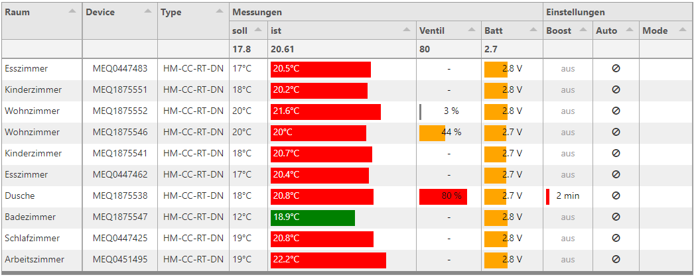

# ui-table

## customizing ui-table by sending ```msg.ui_control``` messages

ui-table is based on the **tabulator** module and can be customized by sending configuration data to `msg.ui_control.tabulator`. You can find an excellent in depth [documentation here](http://tabulator.info/docs/4.4) with many [examples here](http://tabulator.info/examples/4.4).



by adding ***headers***, ***footers***, ***line*** or ***column grouping*** it is sometimes not possible to determine the amount of lines. Therefore the height can be defined by sending `msg.ui_control.customHeight=lines`. 

Example configuration 

- grouped columns by nesting column definition in ` ui_control.tabulator.columns`
- first column ```frozen``` from horizontal scrolling
- `formatterParams` to define min/max, color, legend or other parameters for `progress` and `planText` formatters 
- functions to format legend values
- ```topCalc``` for average and min/max calculations
- custom icons for `tickCross` formatter
- `tick` formatter
- `groupBy` parameter to use group lines. `groupHeader`function to format legend and adding html tags (not used in the screenshot. Insert a field name in the groupBy paramter at the end of json example below to use this feature)
- `columnResized` and `columnWidth` callback functions using `this.send({})` to pass result to Node-RED. (to avoid a loopback add`ui_control.callback="someText"`
```javascript
 this.send({topic: "anyTopic",payload:"anyPayload",ui_control: {callback:"myCallback"}});
```
- all parameters are named according to tabulator documentation. Use ```field``` instead of ```Property``` used in node configuration
- no validation of `msg.ui_control` data is performed! So if you don`t get the results you expect take a look on your browsers console.

```json
{
    "columnResized": "function(column){ var newColumn = {field: column._column.field, visible: column._column.visible, width: column._column.width, widthFixed: column._column.widthFixed, widthStyled: column._column.widthStyled }; this.send({topic:this.config.topic,ui_control:{callback:'columnResized',columnWidths:newColumn}}); }",
    "columnMoved": "function(column, columns){ var newColumns=[]; columns.forEach(function (column) {         newColumns.push({'field': column._column.field}); }); this.send({topic:this.config.topic,ui_control:{callback:'columnMoved',columns:newColumns}}); }",
    "groupHeader": "function (value, count, data, group) {return value + \"<span style='color:#d00; margin-left:10px;'>(\" + count + \" Thermostat\"+((count>1) ? \"e\" : \"\") + \")</span>\";}",
    "columns": [
        {
            "formatterParams": {
                "target": "_blank"
            },
            "title": "Raum",
            "field": "room",
            "width": 122,
            "frozen": true
        },
        {
            "formatterParams": {
                "target": "_blank"
            },
            "title": "Device",
            "field": "name",
            "width": 113,
            "align": "center"
        },
        {
            "formatterParams": {
                "target": "_blank"
            },
            "title": "Type",
            "field": "deviceType",
            "width": 108,
            "align": "center"
        },
        {
            "title": "Messungen",
            "columns": [
                {
                    "formatterParams": {
                        "target": "_blank"
                    },
                    "title": "soll",
                    "field": "SET_TEMPERATURE-value",
                    "formatter": "function(cell, formatterParams, onRendered){console.log(cell); return cell.getValue()+'°C';}",
                    "topCalc": "avg",
                    "width": 58
                },
                {
                    "formatterParams": {
                        "target": "_blank",
                        "min": 10,
                        "max": 25,
                        "color": [
                            "blue",
                            "green",
                            "red"
                        ],
                        "legend": "function (value) {return '&nbsp;&nbsp;'+value+'°C';}",
                        "legendColor": "#FFFFFF",
                        "legendAlign": "left"
                    },
                    "title": "ist",
                    "field": "ACTUAL_TEMPERATURE-value",
                    "formatter": "progress",
                    "topCalc": "avg",
                    "width": 224
                },
                {
                    "formatterParams": {
                        "target": "_blank",
                        "min": 0,
                        "max": 99,
                        "color": [
                            "gray",
                            "orange",
                            "red"
                        ],
                        "legend": "function (value) {return (value>0)? '&nbsp;&nbsp;'+value+' %' : '-';}",
                        "legendColor": "#101010",
                        "legendAlign": "center"
                    },
                    "title": "Ventil",
                    "field": "VALVE_STATE-value",
                    "formatter": "progress",
                    "topCalc": "max",
                    "width": 98
                },
                {
                    "formatterParams": {
                        "target": "_blank",
                        "min": 1.5,
                        "max": 4.6,
                        "color": [
                            "red",
                            "orange",
                            "green"
                        ],
                        "legend": "function (value) {return value+' V';}",
                        "legendColor": "#101010",
                        "legendAlign": "center"
                    },
                    "title": "Batt",
                    "field": "BATTERY_STATE-value",
                    "formatter": "progress",
                    "topCalc": "min",
                    "width": 93
                }
            ]
        },
        {
            "title": "Einstellungen",
            "columns": [
                {
                    "formatterParams": {
                        "target": "_blank",
                        "min": 0,
                        "max": 30,
                        "color": [
                            "red",
                            "orange",
                            "green"
                        ],
                        "legend": "function (value) {     if (value>0)         return \"<span style='color:#ffffff;'>\"+value+\" min</span>\";     else         return \"<span style='color:#A0A0A0;'>aus</span>\"; }",
                        "legendColor": "#FFFFFF",
                        "legendAlign": "center"
                    },
                    "title": "Boost",
                    "field": "BOOST_STATE-value",
                    "formatter": "progress",
                    "width": 75
                },
                {
                    "formatterParams": {
                        "target": "_blank",
                        "allowEmpty": true,
                        "allowTruthy": true,
                        "tickElement": "<i class='fa fa-clock-o'></i>",
                        "crossElement": "<i class='fa fa-ban'></i>"
                    },
                    "title": "Auto",
                    "field": "AUTO_MODE-value",
                    "formatter": "tickCross",
                    "width": 70,
                    "align": "center"
                },
                {
                    "formatterParams": {
                        "target": "_blank"
                    },
                    "title": "Mode",
                    "field": "CONTROL_MODE-value",
                    "formatter": "tick",
                    "width": 80,
                    "align": "center"
                }
            ]
        }
    ],
    "layout": "fitColumns",
    "movableColumns": true,
    "groupBy": ""
}
'''