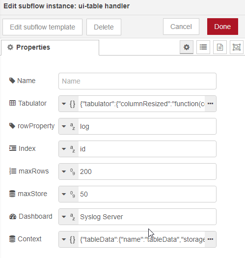

# systlog server

Just finished a syslog server for the node-red dashboard. It makes use of ui-table. I hope somebody finds it useful. It is build around ui-table and a subflow I use for all kinds of tables in my projects.

## Features

* can handle quite huge amounts of data only limited by the clients browser. As every line is sent individually Node-RED is don`t have to hold the complete table (amount limited by maxDisplay) Managed to get more than 100.000 rows before chrome spits out an out of memory error (maxDisplay=0)
* can store lines for reconnects for tab changes or new clients (amount limited by maxStore) (maxStore = 0 will eat all Node-Red memory!)
* store messages in background (when the table is invisible)
* filter messages by host right at the input
* can use the filter capabilities of ui-table for existing data.
* columns can be resized and ordered (layout will be saved)

I don't know if it useful or only a showing the features of ui-table. BTW: Is a log handler available to send Node-RED log as Syslog messages? I don`t want to reinvent the wheel. That could be a nice usecase too.

**Important**: Enter the name of your dashboard tab into the ui-table handler config.

You find the syslog.json here in this directory

## Technical things
* `ui-table handler` take care of everything around ui-table. Sending Data line by line. Updating existing Data (as used in remote device table), sorting/hiding columns and rows. and many other things
* keeping control of the amount of rows in the font-end is a little bit crudely implemented  but effective by simply deleting currentId-maxRows if currentId-maxRows>0. If the flow stumbles there could be old rows left. They will disappear after tab change or refresh. If maxStore is smaller than maxRows in the beginning non existing rows will be "deleted" after refresh. But ui-table seems fine with that.
* all data preparation is done in `feed table` so it could be adopted for other sources.
* I used the syslog input node (https://flows.nodered.org/node/node-red-contrib-syslog-input)
* the table is formatted by a json configured in ui-table handler (more info see tabulator docs)
* ui-table filters only apply to existing data. New rows will appear unfiltered. Don`t know right now to solve this right now.

 